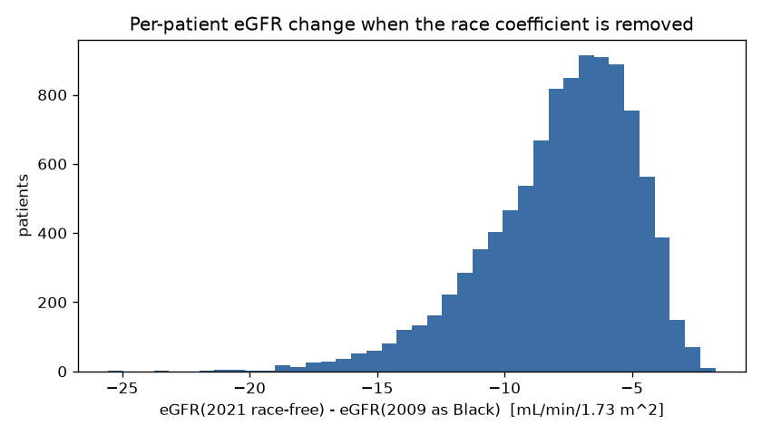
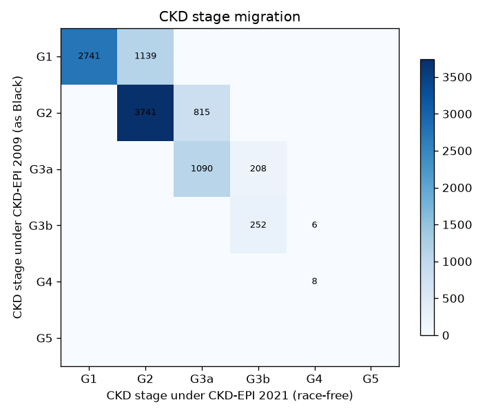
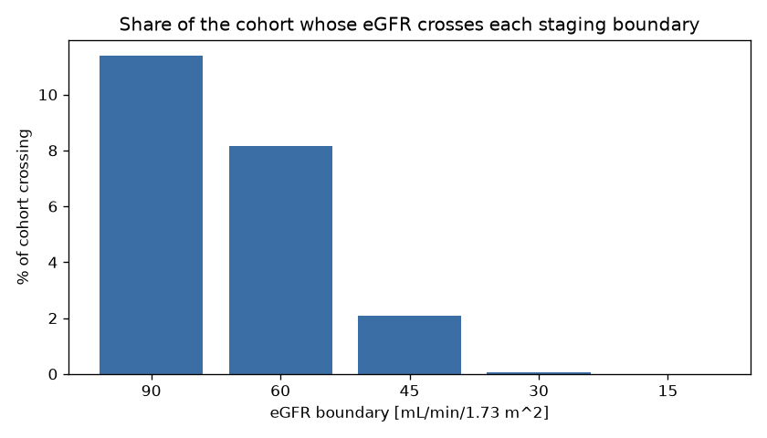
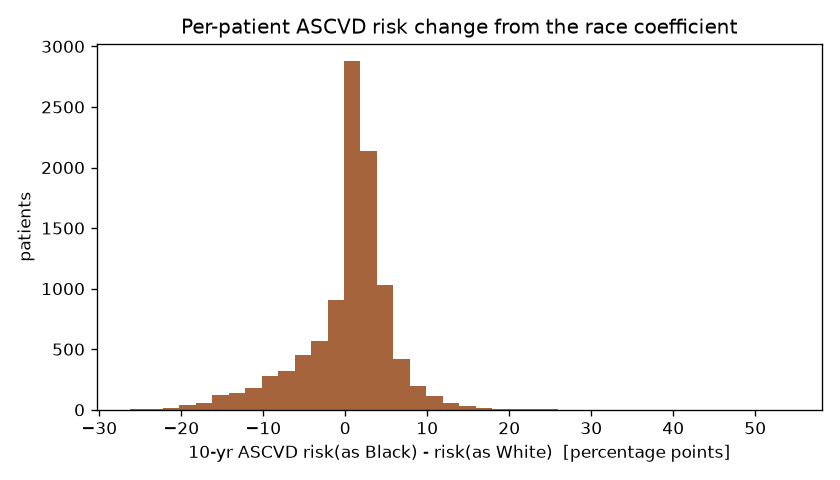
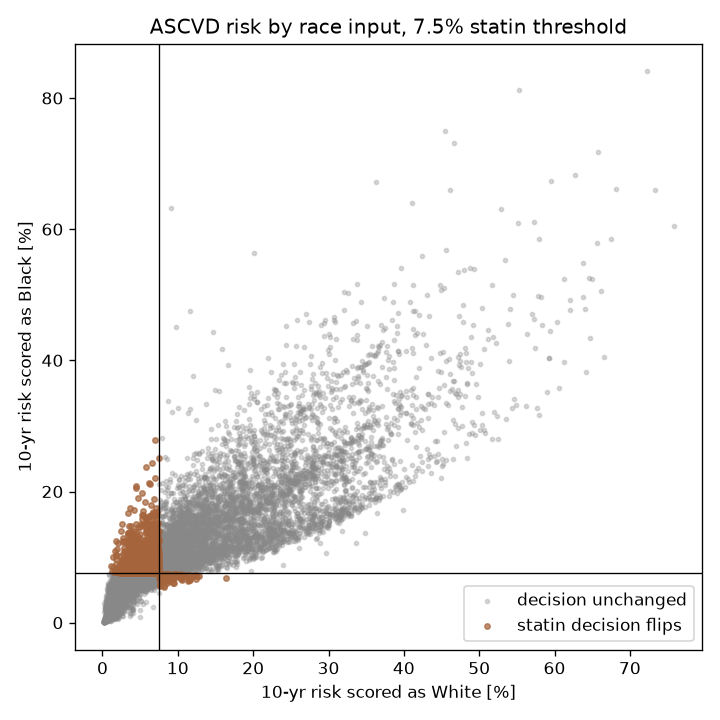
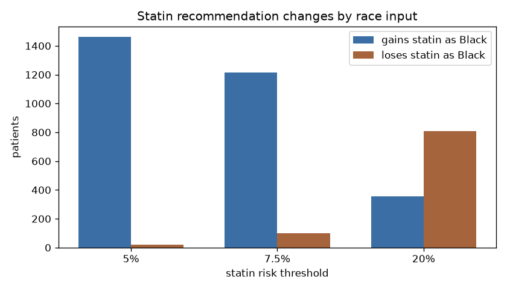

# Clinical Calculator Bias Audit

This repository measures how the **race coefficients** built into two widely used
clinical calculators change patient-level clinical decisions. It scores a
**seeded synthetic cohort** of 10,000 patients through each calculator twice —
once with the race term and once without (or with the other race's coefficients)
— holding every other input fixed, and counts how often the *category* a patient
lands in (a CKD stage, a statin recommendation) depends only on that coefficient.

## Why this matters

Race-adjusted clinical algorithms embed a social category into quantitative
decision tools, and several have been shown to divert care away from Black
patients. The framing here follows Vyas V, Eisenstein LG, Jones DS. *Hidden in
Plain Sight — Reconsidering the Use of Race Correction in Clinical Algorithms.*
N Engl J Med 2020;383:874–882
(<https://www.nejm.org/doi/full/10.1056/NEJMms2004740>). This repo does not add
new evidence; it is a small, reproducible demonstration of the mechanism on
synthetic data.

## The two calculators

- **eGFR — kidney function.** CKD-EPI **2009**, which multiplies the estimated
  GFR by **1.159** when the patient is recorded as Black, versus CKD-EPI **2021**,
  which drops race entirely and re-fits the equation. Each patient's serum
  creatinine, age and sex are held fixed; only the equation version changes.
- **ASCVD — 10-year cardiovascular risk.** The 2013 ACC/AHA **Pooled Cohort
  Equations**, scored with the **White** coefficient set and then with the
  **Black** coefficient set on identical covariates (age, total and HDL
  cholesterol, systolic blood pressure, blood-pressure treatment, smoking,
  diabetes, sex).

## Method

- **Cohort:** `src/cohort.py`, `generate_cohort(n=10_000, seed=20260906)`. Race
  is **not** generated — it is the toggle applied afterward. Distributions are
  **illustrative, not epidemiologically calibrated** (the within-patient change
  when race flips does not depend on the cohort being a calibrated population
  sample):

  | field | distribution |
  |---|---|
  | `age` | uniform integer 40–79 |
  | `sex` | Bernoulli 0.5 → {female, male} |
  | `scr_mg_dl` | lognormal, median ~0.9 (female) / ~1.1 (male), clipped to [0.4, 6.0] |
  | `total_chol` | normal mean 200, sd 35, clip [120, 320] |
  | `hdl` | normal mean 52, sd 15, clip [20, 100] |
  | `sbp` | normal mean 130, sd 18, clip [90, 200] |
  | `bp_treated` | Bernoulli 0.35 |
  | `smoker` | Bernoulli 0.18 |
  | `diabetes` | Bernoulli 0.12 |

- **Audit:** every patient is scored both ways. `d_egfr = egfr_2021 −
  egfr_2009_black`; `d_risk = risk_black − risk_white`. A patient is counted as
  **reclassified** if their CKD stage changes **or** their statin recommendation
  at the 7.5% threshold changes. Statin thresholds of 5%, 7.5% and 20% are all
  reported.
- Every number and figure below is generated by `python -m src.audit` and written
  into `results/`. Nothing in this section is hand-typed.

## Results

> 32.2% of the synthetic cohort (n=10000) receives a different clinical category — a CKD stage or a statin recommendation at the 7.5% threshold — depending only on a race coefficient.

| Metric | Value |
| --- | --- |
| n_patients | 10000.000 |
| egfr_mean_d | -7.820 |
| egfr_q1_d | -9.443 |
| egfr_q3_d | -5.678 |
| egfr_pct_stage_changed | 21.680 |
| egfr_pct_more_advanced_2021 | 21.680 |
| egfr_pct_boundary_crossed | 21.680 |
| ascvd_mean_d_risk_pp | 0.325 |
| ascvd_q1_d_risk_pp | -1.208 |
| ascvd_q3_d_risk_pp | 3.068 |
| ascvd_pct_cross_0_05 | 14.810 |
| ascvd_n_gained_statin_0_05 | 1462.000 |
| ascvd_n_lost_statin_0_05 | 19.000 |
| ascvd_pct_cross_0_075 | 13.120 |
| ascvd_n_gained_statin_0_075 | 1213.000 |
| ascvd_n_lost_statin_0_075 | 99.000 |
| ascvd_pct_cross_0_2 | 11.640 |
| ascvd_n_gained_statin_0_2 | 355.000 |
| ascvd_n_lost_statin_0_2 | 809.000 |

Metrics prefixed `egfr_*_d` are in mL/min/1.73 m²; `ascvd_*_pp` are percentage
points of absolute 10-year risk.



Per-patient change in eGFR when the race coefficient is removed — the whole
distribution sits below zero, so every patient's race-free 2021 eGFR is lower
than their 2009 "as Black" value.



CKD stage under CKD-EPI 2009 (as Black, rows) versus CKD-EPI 2021 (race-free,
columns); off-diagonal cells are patients whose stage changes, all toward a more
advanced stage.



Share of the cohort whose eGFR crosses each CKD staging boundary (90, 60, 45, 30,
15) when the race coefficient is removed.



Per-patient change in 10-year ASCVD risk (scored as Black minus scored as White);
the shift is smaller and two-sided but predominantly positive.



Risk scored as White versus as Black for each patient, with the 7.5% statin
lines; coloured points are patients whose statin recommendation flips.



Patients gaining versus losing a statin recommendation when scored as Black
rather than White, at the 5%, 7.5% and 20% thresholds.

## How these compare to published cohorts

- **eGFR.** In the US Military Health System cohort, adopting the race-free 2021
  equation raised the number of Black adults classified at CKD stage 3–5 by
  **58%**, with **45.8%** reclassified to a more advanced stage
  (<https://www.ncbi.nlm.nih.gov/pmc/articles/PMC11295453/>).
- **ASCVD.** Moving from the Pooled Cohort Equations to the newer race-free
  PREVENT equations, **21.7%** of non-Hispanic Black adults with a PCE risk
  ≥ 7.5% fall below the PREVENT 5% treatment threshold
  (<https://www.sciencedirect.com/science/article/pii/S1933287426004319>).

The synthetic results here move in the **same direction and rough order of
magnitude**. This is a plausibility check, **not** a validation of the synthetic
cohort — the distributions above are illustrative and were not calibrated to any
population.

## Limitations

- **Synthetic data.** The cohort is generated from illustrative distributions; it
  is not a population sample and the absolute counts have no epidemiological
  meaning.
- **Not clinical validation, not for clinical use.** Nothing here is a validated
  reimplementation of any calculator for patient care.
- **Race as a crude binary toggle.** Race is operationalized as a White/Black
  switch *by design*, because that is exactly what the audited equations do — the
  2009 eGFR equation has a single Black multiplier and the Pooled Cohort
  Equations have only White and Black coefficient sets. No other categories
  exist in these models to represent.
- **The eGFR "% reclassified" is an upper bound.** It describes the affected
  subgroup — patients a 2009-era clinic would have recorded as Black and scored
  with the multiplier — not the whole population. Population-level impact is
  smaller in proportion to that subgroup's size.

## Run it

```bash
python -m venv .venv && .venv/bin/pip install -r requirements.txt
.venv/bin/python -m src.audit    # regenerates everything in results/
.venv/bin/pytest -v
```

## Sources

- Vyas V, Eisenstein LG, Jones DS. Hidden in Plain Sight — Reconsidering the Use
  of Race Correction in Clinical Algorithms. NEJM 2020;383:874–882 —
  <https://www.nejm.org/doi/full/10.1056/NEJMms2004740>
- Inker LA, et al. New Creatinine- and Cystatin C–Based Equations to Estimate GFR
  without Race (CKD-EPI 2021). NEJM 2021 —
  <https://www.nejm.org/doi/full/10.1056/NEJMoa2102953>
- Goff DC, et al. 2013 ACC/AHA Guideline on the Assessment of Cardiovascular Risk
  (Pooled Cohort Equations). Circulation —
  <https://www.ahajournals.org/doi/10.1161/01.cir.0000437741.48606.98>
- Race-free eGFR impact, US Military Health System —
  <https://www.ncbi.nlm.nih.gov/pmc/articles/PMC11295453/>
- Statin eligibility, PCE → PREVENT —
  <https://www.sciencedirect.com/science/article/pii/S1933287426004319>

## How this was built

Designed and directed by Thamer Almutairi. Implementation was AI-assisted under
his direction. Not peer-reviewed; not medical advice.

## License

MIT — see [LICENSE](LICENSE).
